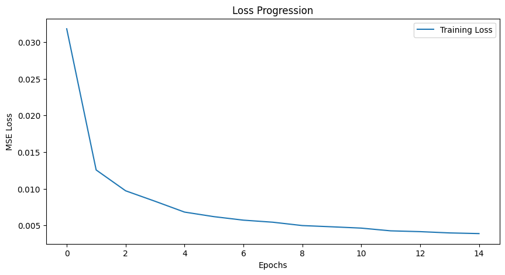
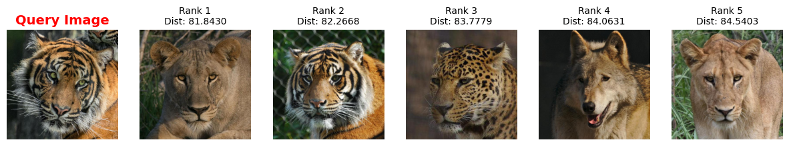
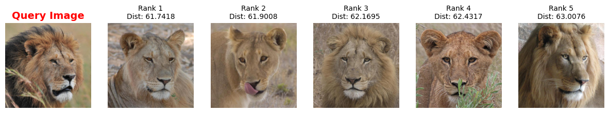
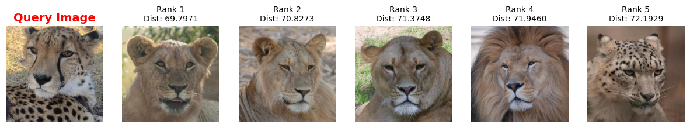

# **🎯 오토인코더 기반 Animal Image Retrieval(CBIR) 구현**

## **결론 및 프로젝트 분석**

### 1. 프로젝트 요약
> 본 프로젝트는 Convolutional Autoencoder(CAE)를 활용하여 동물 이미지 데이터셋에 대한 유사 이미지 검색(CBIR) 시스템을 구현하였습니다.

- 모델 구조: Encoder(특징 추출)와 Decoder(이미지 복원)로 구성된 CNN 기반 오토인코더.

```python
class ConvAutoencoder(nn.Module):
    def __init__(self):
        super(ConvAutoencoder, self).__init__()

        # [Encoder] : 128x128 -> 64x64 -> 32x32 -> 16x16 (압축)
        self.encoder = nn.Sequential(
            nn.Conv2d(3, 16, 3, stride=2, padding=1), # (3, 128, 128) -> (16, 64, 64)
            nn.ReLU(),
            nn.Conv2d(16, 32, 3, stride=2, padding=1), # (16, 64, 64) -> (32, 32, 32)
            nn.ReLU(),
            nn.Conv2d(32, 64, 3, stride=2, padding=1), # (32, 32, 32) -> (64, 16, 16)
            nn.ReLU()
        )

        # [Decoder] : 16x16 -> 32x32 -> 64x64 -> 128x128 (복원)
        self.decoder = nn.Sequential(
            nn.ConvTranspose2d(64, 32, 3, stride=2, padding=1, output_padding=1), # (64, 16, 16) -> (32, 32, 32)
            nn.ReLU(),
            nn.ConvTranspose2d(32, 16, 3, stride=2, padding=1, output_padding=1), # (32, 32, 32) -> (16, 64, 64)
            nn.ReLU(),
            nn.ConvTranspose2d(16, 3, 3, stride=2, padding=1, output_padding=1), # (16, 64, 64) -> (3, 128, 128)
            nn.Sigmoid() # 픽셀 값 0~1 사이로 복원
        )

    def forward(self, x):
        encoded = self.encoder(x)
        decoded = self.decoder(encoded)
        return decoded
    
    # 특징 추출을 위한 편의 함수 (학습 후 사용)
    def get_latent_feature(self, x):
        with torch.no_grad():
            encoded = self.encoder(x)
            # (Batch, 64, 16, 16) -> (Batch, 64*16*16) = (Batch, 16384) 형태로 평탄화
            flattened = encoded.view(encoded.size(0), -1)
        return flattened
```

- 핵심 원리: 이미지를 픽셀 단위로 비교하는 것이 아니라, 학습된 모델이 추출한 Latent Feature(잠재 특징) 벡터 간의 유클리드 거리(Euclidean Distance)를 계산하여 유사도를 판단함.

```python
from sklearn.neighbors import NearestNeighbors

# 1. 검색 엔진 설정 (유클리드 거리 기준)
# n_neighbors=6 인 이유: 자기 자신(거리 0)이 1등으로 나오기 때문에, 자기 자신 포함 상위 6개를 뽑습니다.
knn = NearestNeighbors(n_neighbors=6, metric='euclidean')
knn.fit(features_db)

def search_and_visualize(query_idx):
    """
    데이터셋 내의 특정 인덱스(query_idx) 이미지를 Query로 사용하여
    가장 유사한 이미지 5장을 시각화합니다.
    """

    # Query 이미지의 특징 벡터 가져오기
    query_feature = features_db[query_idx].reshape(1, -1)

    # 검색 실행 (거리와 인덱스 반환)
    distances, indices = knn.kneighbors(query_feature)

    # 결과 시각화
    plt.figure(figsize=(15, 5))

    # 결과 출력 (첫 번째는 Query 이미지, 그 뒤로 유사한 이미지들)
    for i in range(6):
        found_idx = indices[0][i]
        dist = distances[0][i]

        # 이미지 로드
        img_path = image_paths[found_idx]
        img = Image.open(img_path).convert("RGB")

        ax = plt.subplot(1, 6, i + 1)

        if i == 0:
            ax.set_title("Query Image", color='red', fontsize=14, fontweight='bold')
            # 테두리 강조 (Query)
            for spine in ax.spines.values():
                spine.set_edgecolor('red')
                spine.set_linewidth(3)
        else:
            ax.set_title(f"Rank {i}\nDist: {dist:.4f}", fontsize=10)
            
        plt.imshow(img)
        plt.axis('off')
    
    plt.show()

```


### 2. 학습 결과 분석
- Loss 변화: 학습이 진행됨에 따라 MSE Loss가 0.0039 수준으로 수렴하였으며, 이는 모델이 원본 이미지의 주요 특징을 손실 없이 잘 압축하고 있음을 의미합니다.



- 검색 성능: Query 이미지(예: 호랑이)를 입력했을 때, 같은 종의 동물이나 유사한 색감/자세를 가진 이미지들이 Top-5 결과로 도출되었습니다. 이는 모델이 동물의 [형태, 색상, 배경] 등의 특징을 스스로 학습했음을 보여줍니다.




### 3. 한계점 및 개선 방안 (Future Work)
- 흐릿한 복원: MSE Loss의 특성상 복원된 이미지가 다소 흐릿(Blurry)해지는 경향이 있습니다. 이를 개선하기 위해 GAN(Generative Adversarial Networks) 기반의 학습을 고려할 수 있습니다.

- 복잡한 배경: 동물이 작게 나오거나 배경이 복잡한 경우 검색 정확도가 떨어질 수 있습니다. 이를 위해 객체 탐지(Object Detection) 전처리를 추가하거나 ResNet과 같은 더 깊은 모델을 Encoder로 사용하는 전이 학습(Transfer Learning)을 적용하면 성능을 높일 수 있습니다.
